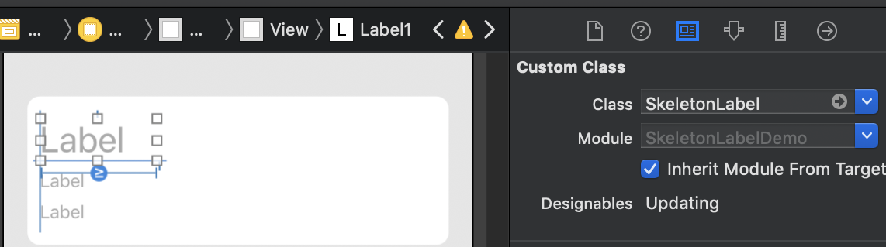
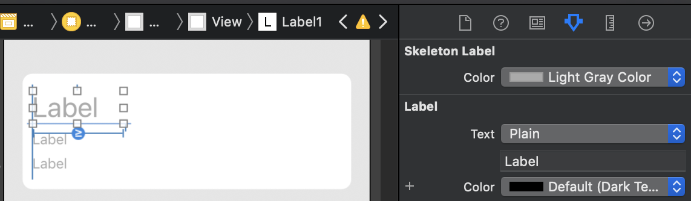

# skeleton-label
A cute little view to make placeholders of your UILabels while content is loading

## Features
* Show "skeleton" view until text is set on any `UILabel`
* Customize skeleton background color
* `skeletonize()` as needed :)

## Usage

## Installation

#### Cocoapods

`pod 'SkeletonLabel', '~> 1.5'`

#### Carthage

`github "poisondminds/skeleton-label" ~> 1.5`
